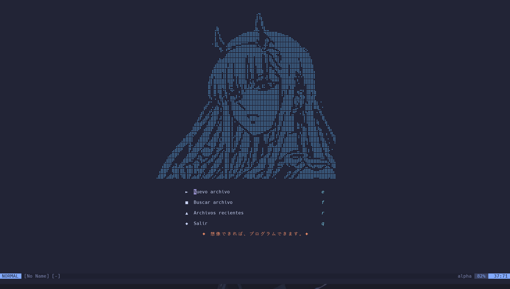

# 🌸 Neovim Config (Windows)

Configuración personalizada de **Neovim** para Windows, con soporte para LSP, autocompletado, dashboard con waifus y tema **Tokyonight**.  

 <!-- (opcional: captura de tu dashboard) -->

---

## 📦 Requisitos

Antes de empezar, instala:

1. **Neovim**  
   Descargar desde [neovim.io](https://neovim.io/) o con [Scoop](https://scoop.sh/):
   ```powershell
   scoop install neovim
   
   ```
2. **Administrador de paquetes Scoop**
    ```powershell
    Set-ExecutionPolicy RemoteSigned -scope CurrentUser
    irm get.scoop.sh | iex

    ```
3. **Fuente Nerd Font (para iconos en la barra y dashboard).
    - Use [JetBrais Mono Nerd Font](https://www.nerdfonts.com/).
        - Descargar el .zip
        - Extraelos
        - Selecciona todos los .ttf -> Instalalos todos

4. **MSYS2 para toolchain de C (necesario para Treesitter y LSP)**
    - Descargar desde: [MSYS2](https://www.msys2.org/).
    - Luego abrir MSYS2 MinGW UCRT64 y ejacutar el siguiente comando
    ```powershell
    pacman -Syu
    pacman -S --needed base-devel mingw-w64-x86_64-toolchain

    ```
    - Esto instala `gcc`, `make`, etc.

5. **Instala dependencias externas**
```powershell
npm install -g eslint_d prettier
pip install flake8 black

```

---
# ⚙️ Instalación

1. Clona este repositorio en tu carpeta de Configuración de Neovim
```powershell
git clone https://github.com/AngelArgumedo/nvim-config.git $env:LOCALAPPDATA\nvim

```

2. Abre Neovim
```powershell
nvim

```

3. La primera vez, lazy.nvim instalara automaticamente los plugins.
espera a que termine y reinicia neovim

---
# 🎨 Plugins incluidos
- Tema: tokyonight.nvim

- Dashboard con waifu ASCII: alpha-nvim, enlace para arte [ASCII](https://emojicombos.com/waifu-ascii-art).

- Barra de estado: lualine.nvim

- Explorador de archivos: nvim-tree.lua

- Buscador: telescope.nvim

- Resaltado avanzado: nvim-treesitter

- Autocompletado: nvim-cmp + fuentes

- Snippets: vim-vsnip

- LSP: nvim-lspconfig, mason.nvimema: tokyonight.nvim

- Dashboard con waifu ASCII: alpha-nvim

- Barra de estado: lualine.nvim

- Explorador de archivos: nvim-tree.lua

- Buscador: telescope.nvim

- Resaltado avanzado: nvim-treesitter

- Autocompletado: nvim-cmp + fuentes

- Snippets: vim-vsnip

- LSP: nvim-lspconfig, mason.nvim

